# Oyuncu Pozisyonları ve Maç Analizi

## 🎯 Proje Amacı

Bu projeyi, futbol maçlarının oyuncu hareketlerini, pas bağlantılarını, top hareketlerini ve oyun stratejilerini analiz ederek görselleştirme ve video analizleriyle sunmak için geliştirdim. Oyuncu pozisyonları, pas bağlantıları ve hedefe yakınlık analizleri gibi metrikler üreterek, futbol analitiği ve scouting süreçlerini desteklemeyi, oyuncu performansını değerlendirmeyi ve stratejik kararlar için yenilikçi çözümler sunmayı hedefledim.

## 📌 Proje Hedefleri

**Oyuncu Performansı Analizi:
- Oyuncuların saha içindeki hareketlerini ve performanslarını detaylı olarak analiz etmek.

**Pas Bağlantıları ve Top Hareketi:
- Pas bağlantılarını ve topun saha üzerindeki hareketini görselleştirerek oyun içi stratejilerin anlaşılmasını kolaylaştırmak.

**Takım Bazlı Analizler:
- Takımların saha içindeki etkinliklerini karşılaştırmalı olarak analiz etmek.

**Zaman Bazlı Analizler:
- Oyuncu ve top hareketlerini zaman içinde inceleyerek oyun içindeki dinamikleri anlamak.

**Hedefe Yakınlık Analizi:
- Oyuncuların ve topun kaleye olan mesafelerini analiz ederek etkili pozisyonları tespit etmek.

**Video Analizi Entegrasyonu:
- Analiz sonuçlarını maç videolarıyla senkronize ederek görsel olarak sunmak.

**Gelişmiş Veri Modelleme:
- Makine öğrenmesi algoritmaları kullanarak oyuncu rollerini ve stratejik oyun kalıplarını belirlemek.

---

## 📈 Proje Sonuçları

1. **Dinamik Pozisyon Analizi**
   - Videodan oyuncuların pozisyonlarını tespit ederek bir CSV dosyasına kaydettim. Bu verilerle, oyuncuların saha üzerindeki hareket yoğunluklarını futbol sahası üzerinde ısı              haritası şeklinde görselleştirdim.

2. **Pas ve Top Hareket Analizi**
   - Pas ve top hareketlerini analiz ederek oyuncular arasındaki pas bağlantılarını simüle ettim ve en çok pas yapan oyuncuları belirledim. Ayrıca, topun sahadaki hareket yoğunluğunu       ve belirli bölgelerdeki dinamiklerini inceledim.

3. **Takım Bazlı Analizler**
   - Takım analizlerinde oyuncuları takımlara ayırarak her takımın saha içindeki hareket yoğunluklarını ve pas örüntülerini görselleştirdim.

4. **Zaman Bazlı Hareket Analizi**
   - Oyuncuların ve topun belirli zaman dilimlerindeki pozisyonlarını analiz ederek hareketlerin oyun içindeki zamanlaması ve etkilerini inceledim.

5. **Hedefe Yakınlık Analizi**
   - Hedefe yakınlık analizinde oyuncuların ve topun kaleye olan uzaklıklarını zaman içinde takip ederek etkili pozisyonları tespit ettim.

6. **Gelişmiş Veri Modelleme**
   - Gelişmiş veri modelleme tekniklerini kullanarak oyuncuların rollerini ve stratejik davranışlarını belirlemek için veri madenciliği ve kümeleme yöntemlerini uyguladım.

7. **Video Analizi ile Entegrasyon**
   - Analiz edilen tüm verileri bir futbol videosu üzerine entegre ettim. Bu sayede, oyuncu pozisyonları ve önemli anlar görsel olarak video üzerinde vurgulandı.

---

## 📋 Projenin İçeriği

### 1. Oyuncu Pozisyonları Isı Haritası
- Oyuncuların saha üzerindeki hareketlerini ısı haritası şeklinde görselleştirdim.

### 2. Pas ve Top Hareket Analizi
- Oyuncular arasındaki pas bağlantılarını ve topun saha üzerindeki hareketini analiz ettim.

### 3. Takım Bazlı Analizler
- İki takımın saha içindeki etkinliklerini kıyasladım.

### 4. Zaman Bazlı Hareket Analizi
- Oyuncuların ve topun zaman içindeki hareketlerini inceleyerek oyun dinamiklerini anlamaya çalıştım.

### 5. Hedefe Yakınlık Analizi
- Oyuncuların ve topun kaleye olan yakınlıklarını analiz ederek etkili pozisyonları tespit ettim.

### 6. Gelişmiş Veri Modelleme
- Veri madenciliği ve makine öğrenmesi yöntemleriyle oyuncu rolleri ve oyun kalıplarını belirledim.

### 7. Video Analizi ile Entegrasyon
- Analiz verilerini maç videolarıyla entegre ederek görsel bir sunum sağladım.

---

## 🛠️ Kullanılan Teknolojiler ve Araçlar

| **Teknolojiler Araçlar**              | **Kullanım Amacı**                                     |
|---------------------------------------|--------------------------------------------------------|
| Python                                | Veri işleme ve analiz için temel programlama dili.     |
| OpenCV                                | Video işleme ve çıktı videoları oluşturma.             |
| Mediapipe                             | Oyuncu ve top pozisyonlarının tespiti.                 |
| mplsoccer                             | Futbol sahası görselleştirme ve analiz grafikleri      |
| NetworkX                              | Pas ağlarının görselleştirilmesi.                      |
| Pandas                                | Veri manipülasyonu ve CSV dosyalarını işleme.          |
| Matplotlib                            | Görselleştirme.                                        |
| NumPy                                 | Profesyonel veri görselleştirme.                       |
| Scikit-learn                          | Makine öğrenmesi ve gelişmiş veri analizi.             |
| itertools (combinations)              | Oyuncu bağlantılarını analiz için kullanıldı.          |
| collections (Counter)                 | Frekans hesaplamaları için kullanıldı.                 |
| Tableau                               | Profesyonel veri görselleştirme.                       |

---

## 🚀 Projenin Çalıştırılması

### Gereksinimler
- Python 3.8+
- Gerekli Python kütüphaneleri (pandas, matplotlib, seaborn, scikit-learn, imbalanced-learn, networkx)

## Kurulum

1. Bu projeyi yerel makinenize klonlayın:
   ```bash
   git clone https://github.com/goktugkucukdereli/Futbol-Scouting-ve-Performans-Analizi.git
   ```

2. Sanal bir ortam oluşturun ve gerekli kütüphaneleri yükleyin:
   ```bash
   python -m venv venv
   source venv/bin/activate
   ```
3. Gerekli kütüphaneleri yüklemek için:
    ```bash
    pip install -r requirements.txt
    ```

4. Her bir analiz için ilgili Python dosyasını çalıştırın. Örneğin:
   ```bash
   python src/player_10_heatmap.py
   ```
   Bu analiz, seçilen bir oyuncunun saha üzerindeki hareket yoğunluğunu gösterir.

---

## 📊 Görselleştirmeler ve Analizler

### Oyuncu Pozisyonları Isı Haritası
Bu analizde, oyuncuların saha üzerindeki hareket yoğunluklarını analiz ettim. Görsel, oyuncuların maç boyunca hangi bölgelerde daha sık bulunduklarını göstermektedir.

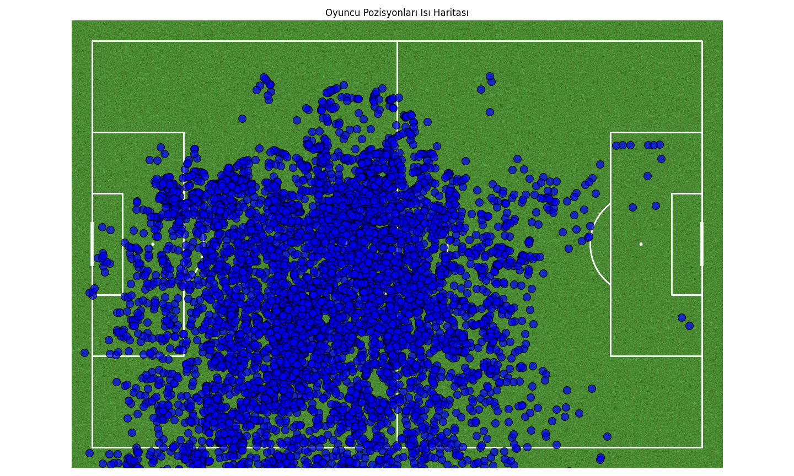

---

### Pas ve Top Hareket Analizi
Bu analizde, oyuncular arasındaki pas bağlantılarını ve topun saha üzerindeki hareketini inceledim. Görsel, oyuncular arasındaki en sık pas bağlantılarını ve topun hangi bölgelerde daha aktif olduğunu göstermektedir.

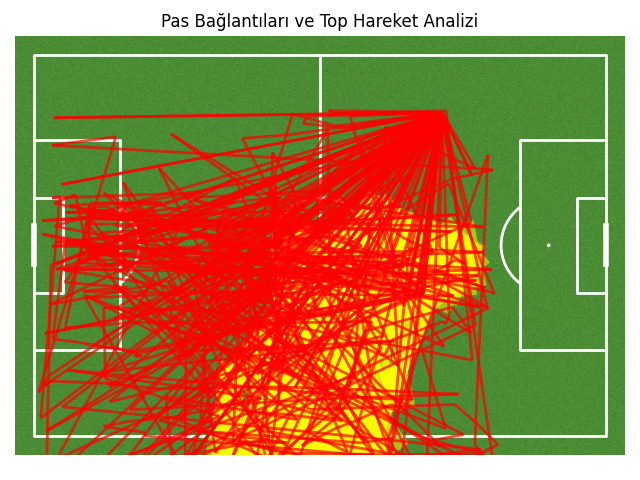

---

### Takım Bazlı Analizler

**Takım A Isı Haritası:**
Takım A'nın saha üzerindeki hareket yoğunluğunu analiz ettim. Görsel, takımın hangi bölgelerde daha fazla hareketlilik gösterdiğini vurgulamaktadır.

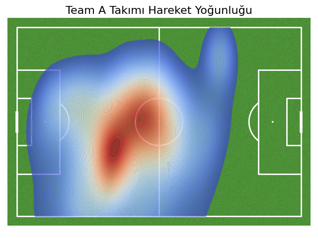

---

**Takım Aktivite Karşılaştırması:**
İki takımın saha içindeki hareketlilik oranlarını kıyasladım. Görsel, takım bazlı hareketlilik farklarını ortaya koymaktadır.

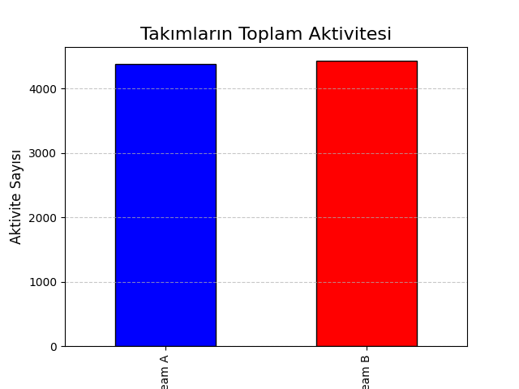

---

### Zaman Bazlı Hareket Analizi
Bu analizde, oyuncuların ve topun zaman içinde nasıl hareket ettiğini inceledim. GIF, belirli zaman aralıklarında oyuncuların ve topun saha üzerindeki pozisyonlarını göstermektedir.

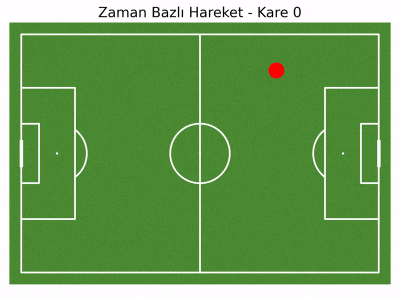

---

### Hedefe Yakınlık Analizi
Bu analizde, oyuncuların ve topun kaleye olan mesafelerini analiz ettim. Görsel, hangi oyuncuların ve topun kaleye en yakın olduğunu zaman bazında göstermektedir.

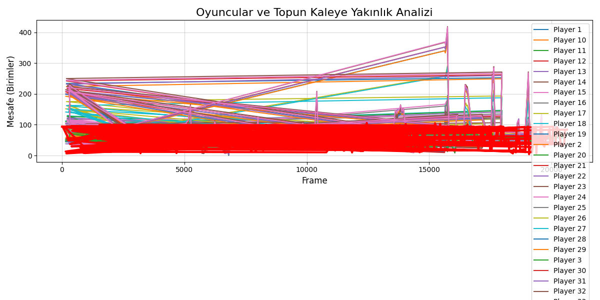

---

### Gelişmiş Veri Modelleme
Makine öğrenmesi yöntemleri kullanarak oyuncuların saha içindeki rollerini analiz ettim. Görsel, oyuncuların hangi taktiksel rolleri üstlendiğini ve saha içindeki davranışlarını göstermektedir.

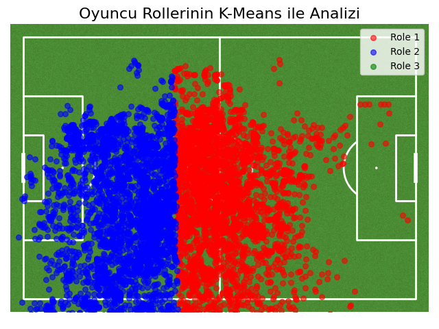

---

### Oyuncu Pas Analizi
Bu analizde, belirli bir oyuncunun pas bağlantılarını inceledim. Görsel, oyuncunun en sık paslaştığı takım arkadaşlarını ve bu bağlantıların sıklığını göstermektedir.

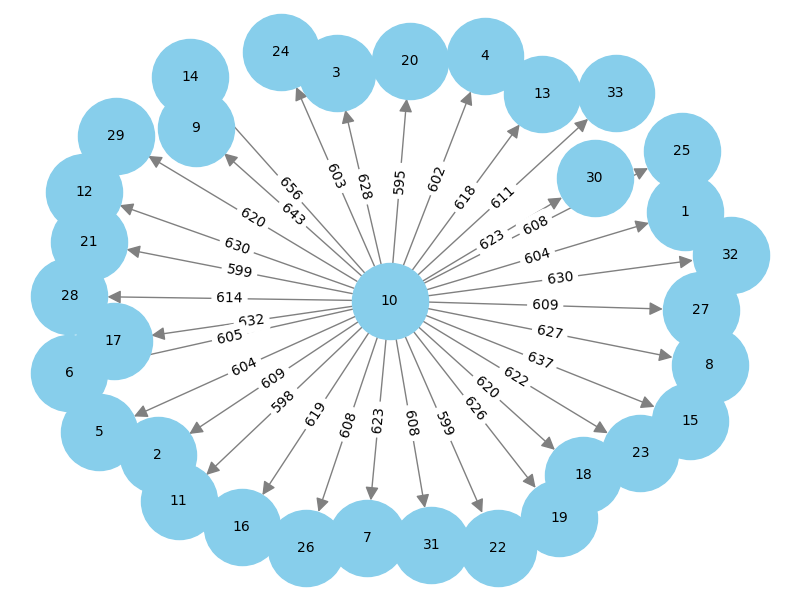

---

### En Aktif Oyuncular (Simüle Edilmiş Pas Verisi)
Simüle edilmiş pas verilerini kullanarak en aktif oyuncuları belirledim. Görsel, en çok pas yapan ve pas alan oyuncuları göstermektedir.

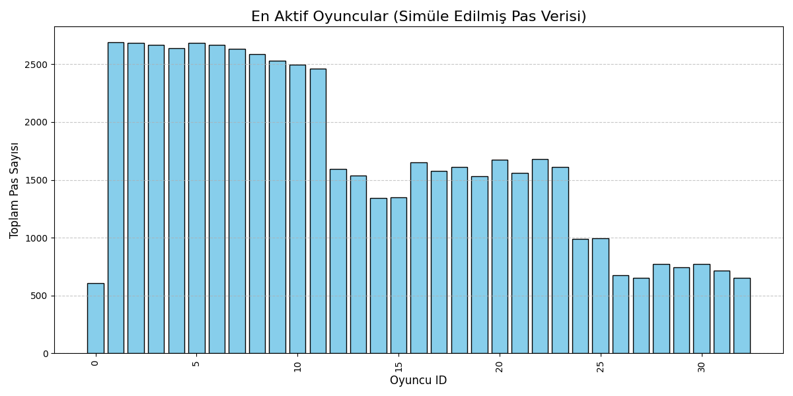

---

### En Aktif Oyuncular (Pozisyon Bazında)
Pozisyon verilerine dayanarak en aktif oyuncuları analiz ettim. Görsel, oyuncuların saha üzerindeki hareketlilik seviyelerini göstermektedir.

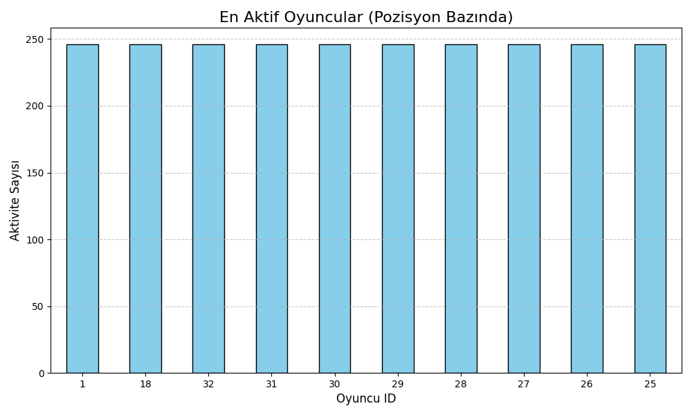

---

### Oyuncu 10 İçin Saha Üzerindeki Hareket Yoğunluğu
Oyuncu 10'un saha üzerindeki hareket yoğunluğunu analiz ettim. Görsel, oyuncunun hangi bölgelerde daha fazla bulunduğunu göstermektedir.

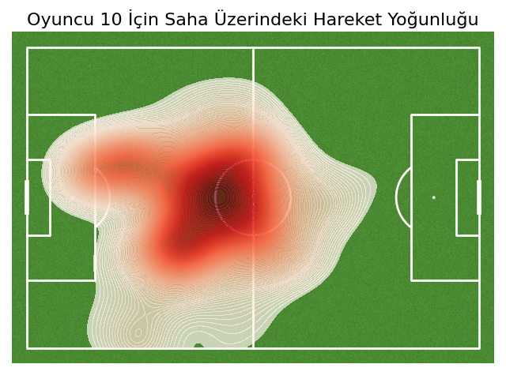

---

### Oyuncular Arasındaki Pas Bağlantı Ağı
Oyuncular arasındaki pas bağlantılarını analiz ettim. Görsel, oyuncular arasındaki pas bağlantılarının sıklığını ve yoğunluğunu göstermektedir.

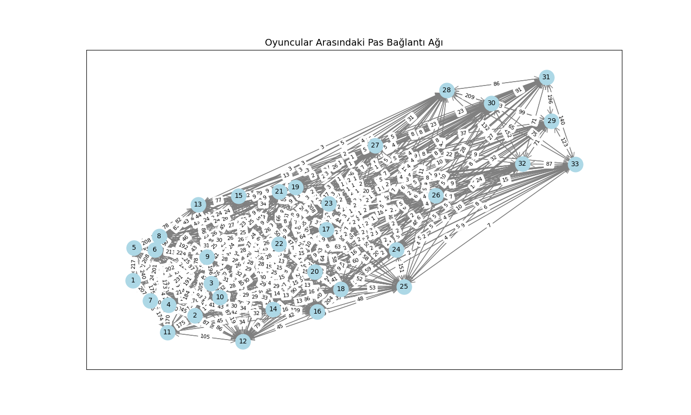

---

### Topa En Yakın Oyuncular
Bu analizde, topa en yakın oyuncuları inceledim. Görsel, maç boyunca hangi oyuncuların topa en yakın olduğunu göstermektedir.

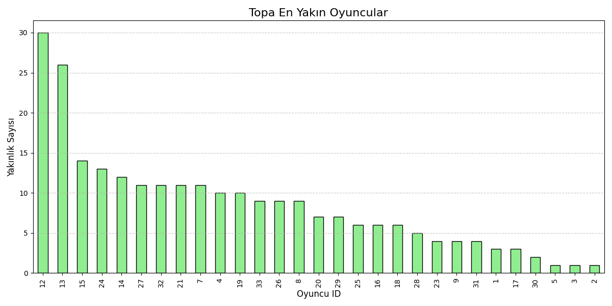

---

### Topun Saha Üzerindeki Yoğunluk Analizi
Topun saha üzerindeki hareketlerini analiz ettim. Görsel, topun en yoğun bulunduğu bölgeleri vurgulamaktadır.

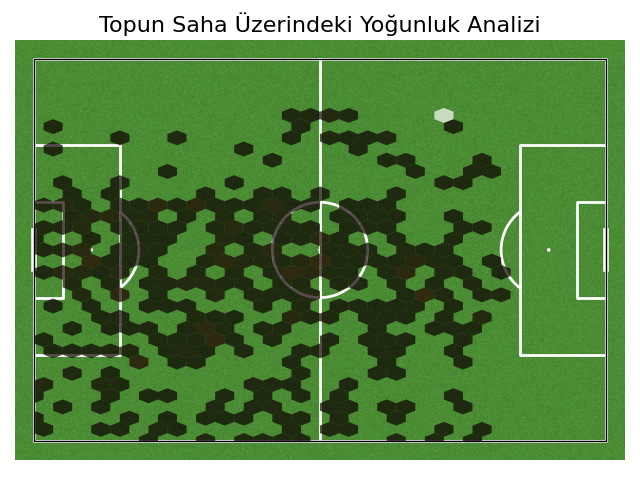

---

### Video Analizi ile Entegrasyon
Bu analizde, maç videosu üzerinde oyuncu pozisyonlarını ve önemli anları görselleştirdim. Görsel, analiz verilerini videoyla senkronize bir şekilde sunmaktadır.

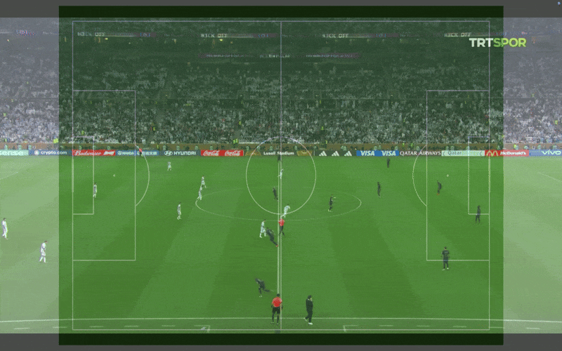

---

## 📂 Proje Yapısı

```plaintext
oyuncu_pozisyonları_ve_maç_analizi/
│
├── data/
│   ├── frames/
│   │   ├── frame_0.jpg
│   │   └── ..
│   │
│   ├── output/
│   │   ├── pass_frequencies.csv
│   │   ├── player_positions_with_teams.csv
│   │   ├── player_positions.csv
│   │   └── player_roles.csv
│   │
│   └── videos/
│       ├── argentina-france_final.mp4
│       └── output_with_analysis.mp4
│
├── fonts/
│   └── DejaVuSans.ttf
│
├── notebooks/
│   └── analysis.ipynb
│
├── reports/
│   └── visuals/
│   │   ├── ball_positions_heatmap.png
│   │   └── ..
│   │
│   ├── analysis_report.pdf
│   └── summary.txt
│
├── src/
│   ├── add_team_info.py
│   └── ..
│
├── venv/
│   └── ..
│
├── main.py
├── README.md
└── requirements.txt
```

---

## 📜 Lisans
Projeyi MIT Lisansı ile lisansladım. Lisans detayları için LICENSE dosyasını inceleyebilirsiniz.
